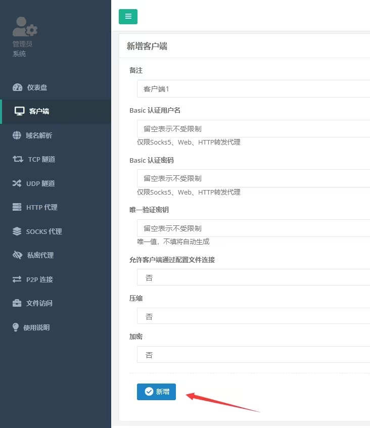
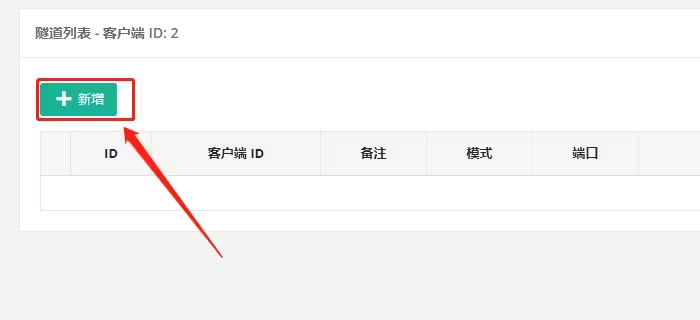
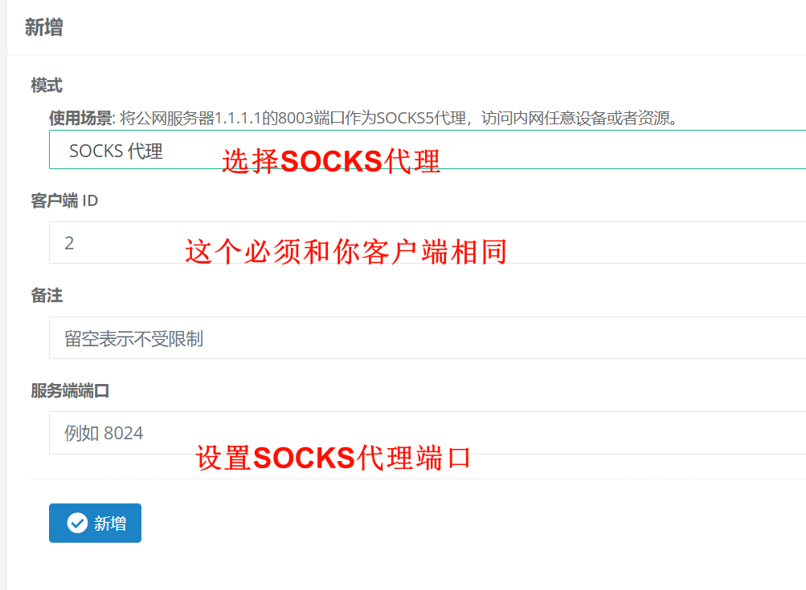
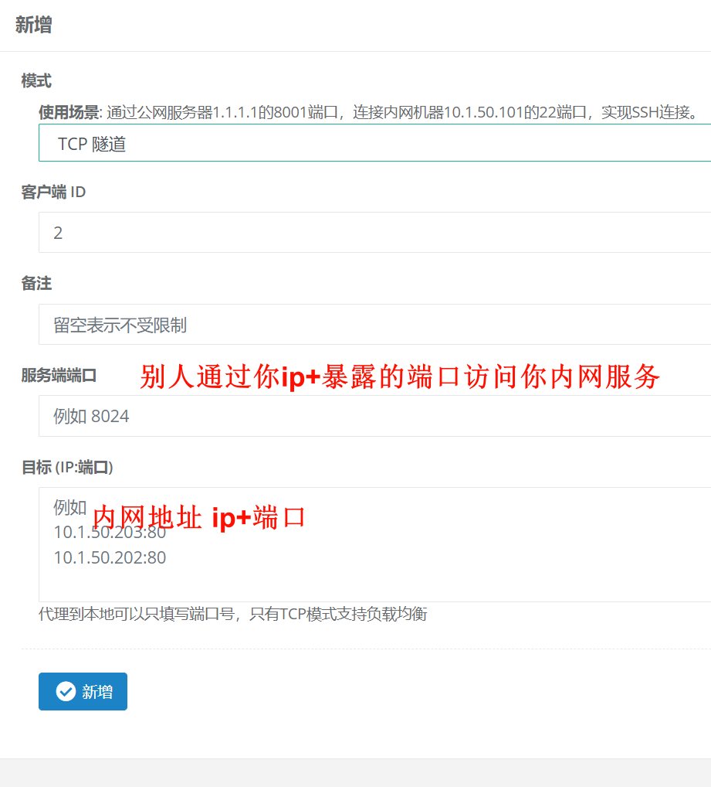
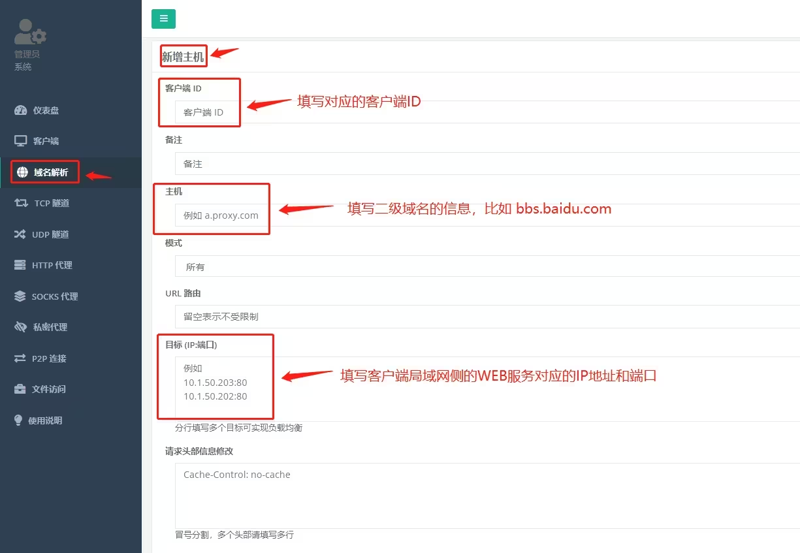

# 内网穿透

## NPS 安装

> NPS 安装在有公网的环境中 给NPC进行内网穿透

### 项目地址

```
https://github.com/ehang-io/nps/releases
```

### 1.下载

``` shell
wget https://github.com/ehang-io/nps/releases/download/v0.26.10/linux_amd64_server.tar.gz
```

### 2.安装NPS

```shell
./nps install  
# 运行这个 NPS 就是全局可以运行的了 然后配置全部在 "/etc/nps"
```

### 3.编辑配置文件

``` shell
nano|vi|vim   /etc/nps/conf/nps.conf 
```

> 重点：配置文件中的auth_key字段，一定要解除注释并且更改数值，不然有被黑风险。
> [漏洞说明](https://mp.weixin.qq.com/s/PTq01wcV4XJwutbSjHjfvA)

配置结束以后，使用以下命令启动NPS服务

### 4.启动nps

```shell
nps start 
```

## NPC 安装

> NPC 安装在内网的环境中 通过NPS进行内网穿透

### 1.下载NPC

``` shell
wget https://github.com/ehang-io/nps/releases/download/v0.26.10/linux_amd64_client.tar.gz
tar -zxvf linux_amd64_client.tar.gz
```

### 2.在NPS配置客户端





```shell
#如果只是单次使用，比如这个客户端只是用一次，那么就执行：
./npc -server=192.168.58.105:8024 -vkey=lyxp4jlp2fhego8g -type=tcp
#如果是需要直接安装，后续需要客户端开关机都能保持在线，需要添加install参数：
./npc install -server=192.168.58.105:8024 -vkey=lyxp4jlp2fhego8g -type=tcp
```

```shell
# 发现连接哪里 为 "离线"  重启一下 NPC
./npc restart
```

## 功能说明

### socks代理

> 使用socks代理可以创建一条私密的网络代理隧道，方便用互联网的另一端连接客户端侧的网络资源。




### TCP代理

> 使用TCP代理可以暴露客户端侧局域网内的服务到互联网提供服务。


### 域名解析

> 域名解析功能可以将客户端侧局域网内的WEB服务暴露到互联网，并且和域名做解析绑定。
> 域名解析设置好以后，需要到域名后台添加对应的DNS解析到服务器IP地址，一般10分钟左右生效即可通过设置的二级域名在互联网上对WEB服务进行访问。
